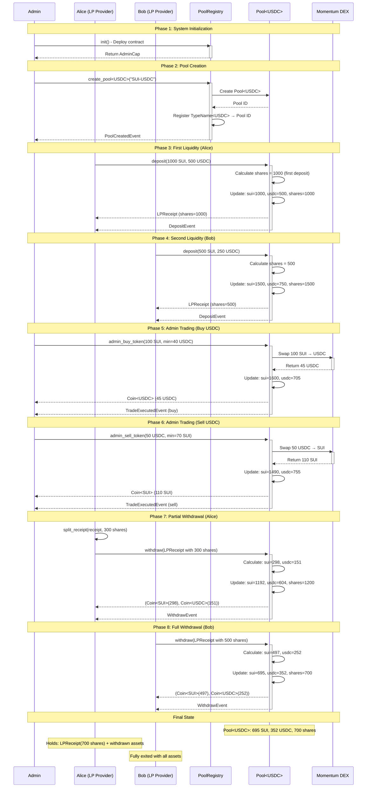
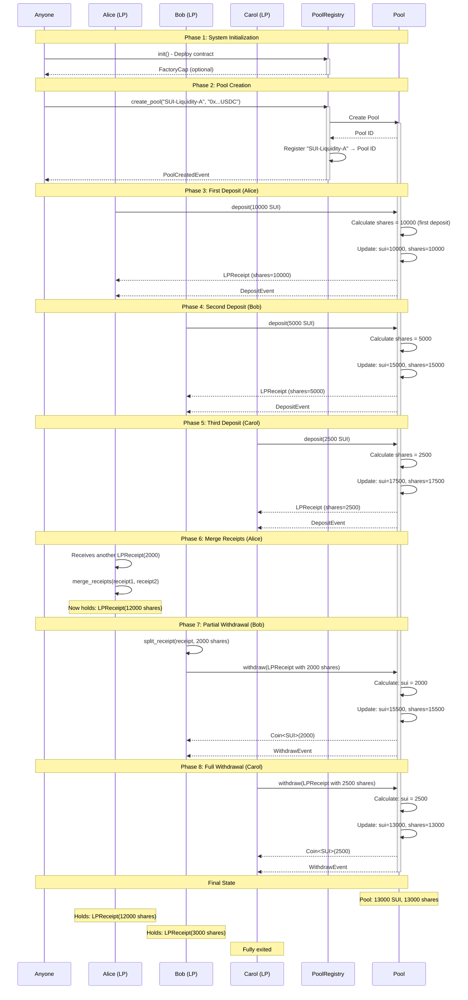
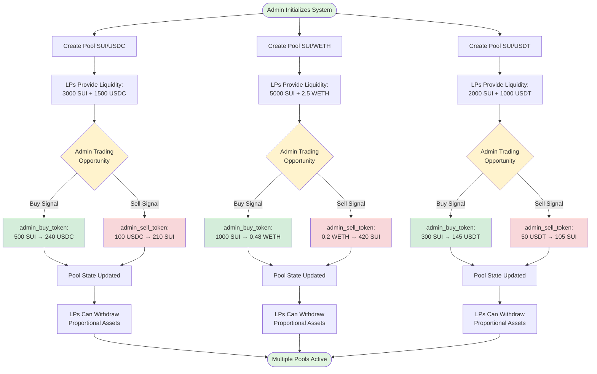
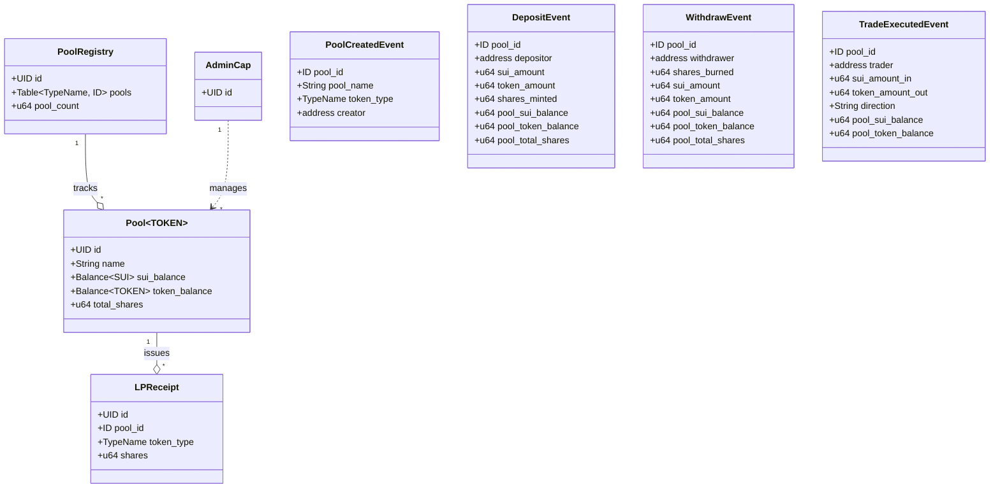
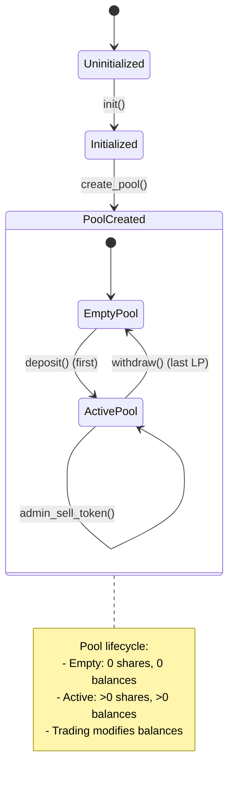
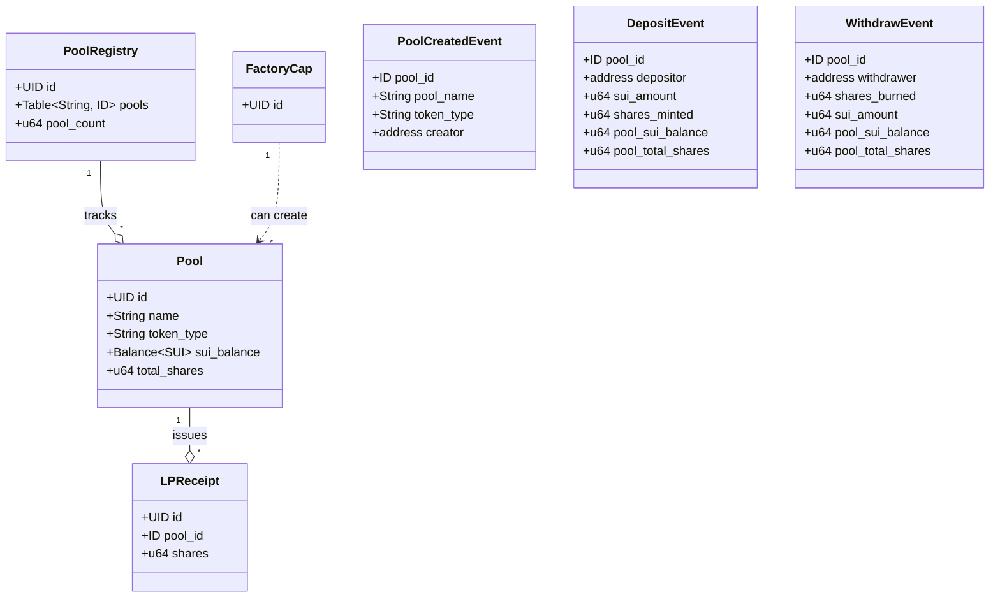
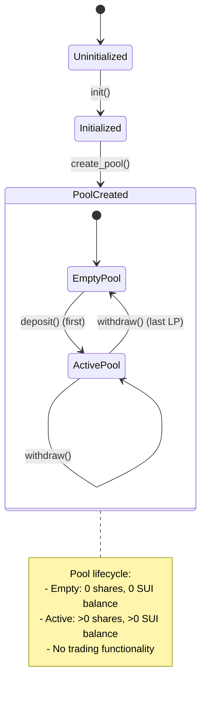

# TradePool Implementation Overview

## Table of Contents
- [System Architecture](#system-architecture)
- [Success User Scenarios](#success-user-scenarios)
- [Module 1: Trading Pool (tradepool.move)](#module-1-trading-pool-tradepoolmove)
- [Module 2: Pool Factory (pool_factory.move)](#module-2-pool-factory-pool_factorymove)
- [Detailed Process Flows](#detailed-process-flows)
- [Mathematical Formulas](#mathematical-formulas)
- [Comparison Matrix](#comparison-matrix)

---

## System Architecture

TradePool consists of two independent implementations serving different use cases:

```
┌─────────────────────────────────────────────────────────────────┐
│                        TradePool Project                         │
├─────────────────────────────────────────────────────────────────┤
│                                                                   │
│  ┌──────────────────────────┐  ┌──────────────────────────────┐ │
│  │   tradepool.move         │  │   pool_factory.move          │ │
│  │   ⭐ Main Implementation  │  │   Simple SUI Pools           │ │
│  ├──────────────────────────┤  ├──────────────────────────────┤ │
│  │ • Generic SUI/TOKEN pairs│  │ • SUI-only pools             │ │
│  │ • DEX trading integration│  │ • Name-based registry        │ │
│  │ • Type-safe pools        │  │ • Basic liquidity provision  │ │
│  │ • Admin trading functions│  │ • No trading functionality   │ │
│  └──────────────────────────┘  └──────────────────────────────┘ │
│                                                                   │
└─────────────────────────────────────────────────────────────────┘
```

---

## Success User Scenarios

### Scenario 1: Complete Trading Pool Journey (tradepool.move)

This diagram shows a complete end-to-end journey for a liquidity provider and admin trader using the Trading Pool system.



### Scenario 2: Complete Pool Factory Journey (pool_factory.move)

This diagram shows a simpler liquidity provision scenario using the Pool Factory implementation.



### Scenario 3: Multi-Pool Trading Strategy

This diagram shows how an admin can manage multiple token pools simultaneously.



### Scenario 4: User Journey Timeline

This timeline shows the typical lifecycle of a liquidity provider in the Trading Pool system.

```
Timeline: Liquidity Provider Journey (Alice)
═══════════════════════════════════════════════════════════════════════════

Day 1: 00:00
├─ Alice learns about TradePool SUI/USDC pool
│  Pool State: 5000 SUI, 2500 USDC, 5000 shares
│
├─ 10:00 - Alice deposits liquidity
│  Input: 1000 SUI + 500 USDC
│  Shares Received: 1000
│  Receipt ID: 0xabc123...
│  Pool State: 6000 SUI, 3000 USDC, 6000 shares
│
└─ Event: DepositEvent emitted

Day 2-10: Holding Period
├─ Multiple admin trades occur
│  ├─ Day 3: Admin buys 200 USDC with SUI
│  │  Pool: 6500 SUI, 2800 USDC, 6000 shares
│  │  Alice's value: ~1083 SUI + ~467 USDC
│  │
│  ├─ Day 5: Admin sells 100 USDC for SUI  
│  │  Pool: 6300 SUI, 2900 USDC, 6000 shares
│  │  Alice's value: ~1050 SUI + ~483 USDC
│  │
│  └─ Day 8: Admin buys 150 USDC with SUI
│     Pool: 6800 SUI, 2750 USDC, 6000 shares
│     Alice's value: ~1133 SUI + ~458 USDC
│
└─ Alice monitors pool performance

Day 11: Partial Exit
├─ 14:00 - Alice splits her receipt
│  Original: LPReceipt(1000 shares)
│  After split: LPReceipt(600) + LPReceipt(400)
│
├─ 14:30 - Alice withdraws 400 shares
│  Receives: ~453 SUI + ~183 USDC
│  Pool State: 6347 SUI, 2567 USDC, 5600 shares
│  Alice still holds: LPReceipt(600 shares)
│
└─ Event: WithdrawEvent emitted

Day 12-30: Continued Holding
├─ More trading activity
│  Pool evolves: 7200 SUI, 2400 USDC, 5600 shares
│  Alice's remaining value: ~771 SUI + ~257 USDC
│
└─ Alice earns from trading fee accumulation

Day 31: Full Exit
├─ 09:00 - Alice withdraws remaining 600 shares
│  Receives: ~771 SUI + ~257 USDC
│  Total withdrawn: ~1224 SUI + ~440 USDC
│  Original deposit: 1000 SUI + 500 USDC
│  Net result: +224 SUI, -60 USDC (due to pool ratio changes)
│
└─ Event: WithdrawEvent emitted

═══════════════════════════════════════════════════════════════════════════
Result: Alice successfully participated in liquidity provision
        Received proportional share of pool assets at each withdrawal
```

### Scenario 5: Error Handling and Edge Cases

This flowchart shows common user scenarios including both success and error paths.

```mermaid
flowchart TD
    Start([User Wants to Interact<br/>with TradePool]) --> CheckModule{Which Module?}
    
    CheckModule -->|Trading Pool| CheckOp1{Operation?}
    CheckModule -->|Pool Factory| CheckOp2{Operation?}
    
    %% Trading Pool Operations
    CheckOp1 -->|Deposit| ValidateDeposit{Valid Amounts?}
    CheckOp1 -->|Withdraw| ValidateReceipt1{Valid Receipt?}
    CheckOp1 -->|Admin Trade| ValidateAdmin{Has AdminCap?}
    
    ValidateDeposit -->|SUI = 0 or<br/>TOKEN = 0| Error1[❌ Error: EZeroAmount]
    ValidateDeposit -->|Both > 0| CheckPoolExists1{Pool Exists?}
    
    CheckPoolExists1 -->|No| Error2[❌ Error: EPoolNotFound]
    CheckPoolExists1 -->|Yes| ExecuteDeposit[✅ Deposit Success<br/>Mint shares<br/>Issue LPReceipt]
    
    ValidateReceipt1 -->|Wrong pool_id or<br/>wrong token_type| Error3[❌ Error: EInvalidReceipt]
    ValidateReceipt1 -->|Shares = 0| Error1
    ValidateReceipt1 -->|Valid| ExecuteWithdraw1[✅ Withdraw Success<br/>Burn receipt<br/>Return SUI+TOKEN]
    
    ValidateAdmin -->|No AdminCap| Error4[❌ Error: Unauthorized]
    ValidateAdmin -->|Has AdminCap| CheckSlippage{Slippage OK?}
    
    CheckSlippage -->|Output < min| Error5[❌ Error: ESlippageExceeded]
    CheckSlippage -->|Insufficient<br/>Balance| Error6[❌ Error: EInsufficientBalance]
    CheckSlippage -->|OK| ExecuteTrade[✅ Trade Success<br/>Update balances<br/>Return tokens]
    
    %% Pool Factory Operations
    CheckOp2 -->|Create Pool| ValidatePoolName{Name Available?}
    CheckOp2 -->|Deposit| ValidateDepositSUI{SUI Amount > 0?}
    CheckOp2 -->|Withdraw| ValidateReceipt2{Valid Receipt?}
    
    ValidatePoolName -->|Name Taken| Error7[❌ Error: EPoolNameTaken]
    ValidatePoolName -->|Available| ExecuteCreate[✅ Pool Created<br/>Registered in table<br/>Shared object]
    
    ValidateDepositSUI -->|SUI = 0| Error1
    ValidateDepositSUI -->|SUI > 0| ExecuteDepositSUI[✅ Deposit Success<br/>Mint shares<br/>Issue LPReceipt]
    
    ValidateReceipt2 -->|Wrong pool_id| Error8[❌ Error: EInsufficientShares]
    ValidateReceipt2 -->|Shares = 0| Error1
    ValidateReceipt2 -->|Valid| ExecuteWithdraw2[✅ Withdraw Success<br/>Burn receipt<br/>Return SUI]
    
    %% Success Paths
    ExecuteDeposit --> Success([✅ Transaction Complete])
    ExecuteWithdraw1 --> Success
    ExecuteTrade --> Success
    ExecuteCreate --> Success
    ExecuteDepositSUI --> Success
    ExecuteWithdraw2 --> Success
    
    %% Error Paths
    Error1 --> Fail([❌ Transaction Failed])
    Error2 --> Fail
    Error3 --> Fail
    Error4 --> Fail
    Error5 --> Fail
    Error6 --> Fail
    Error7 --> Fail
    Error8 --> Fail
    
    style Start fill:#e1f5e1
    style Success fill:#d4edda
    style Fail fill:#f8d7da
    style Error1 fill:#f8d7da
    style Error2 fill:#f8d7da
    style Error3 fill:#f8d7da
    style Error4 fill:#f8d7da
    style Error5 fill:#f8d7da
    style Error6 fill:#f8d7da
    style Error7 fill:#f8d7da
    style Error8 fill:#f8d7da
    style ExecuteDeposit fill:#d4edda
    style ExecuteWithdraw1 fill:#d4edda
    style ExecuteTrade fill:#d4edda
    style ExecuteCreate fill:#d4edda
    style ExecuteDepositSUI fill:#d4edda
    style ExecuteWithdraw2 fill:#d4edda
```



---

## Module 1: Trading Pool (tradepool.move)

### 1.1 Class Diagram



### 1.2 Object Relationships

```
┌─────────────────────────────────────────────────────────────────┐
│                        Object Model                              │
└─────────────────────────────────────────────────────────────────┘

    ┌──────────────────┐
    │  PoolRegistry    │ (Shared Object)
    │  ─────────────   │
    │  pools: Table    │──┐
    │  pool_count: 64  │  │
    └──────────────────┘  │
                          │ Maps TypeName → Pool ID
                          ↓
    ┌──────────────────────────────────────────┐
    │  Pool<USDC>         (Shared Object)      │
    │  ─────────────                           │
    │  id: UID                                 │
    │  name: "SUI-USDC"                        │
    │  sui_balance: Balance<SUI>               │
    │  token_balance: Balance<USDC>            │
    │  total_shares: 1000000                   │
    └──────────────────────────────────────────┘
                ↓ issues
    ┌──────────────────────────────────────────┐
    │  LPReceipt          (Owned Object)       │
    │  ─────────────                           │
    │  id: UID                                 │
    │  pool_id: ID (points to Pool<USDC>)      │
    │  token_type: TypeName (USDC)             │
    │  shares: 5000                            │
    └──────────────────────────────────────────┘
              owned by User

    ┌──────────────────┐
    │  AdminCap        │ (Owned Object)
    │  ─────────────   │
    │  id: UID         │──→ Controls trading functions
    └──────────────────┘
         owned by Admin
```

### 1.3 State Transition Diagram



### 1.4 Process Flow: Create Pool

```
┌──────┐                ┌───────────────┐                ┌──────────────┐
│Admin │                │ Pool Registry │                │ Pool<TOKEN>  │
└──┬───┘                └───────┬───────┘                └──────┬───────┘
   │                            │                               │
   │ create_pool<USDC>()        │                               │
   │ (AdminCap, name)           │                               │
   ├───────────────────────────>│                               │
   │                            │                               │
   │                            │ Check if USDC pool exists     │
   │                            │ (table lookup by TypeName)    │
   │                            │                               │
   │                            │ Create new Pool<USDC>         │
   │                            │───────────────────────────────>│
   │                            │                               │
   │                            │      Pool instance created     │
   │                            │      - sui_balance: 0          │
   │                            │      - token_balance: 0        │
   │                            │      - total_shares: 0         │
   │                            │                               │
   │                            │ Register in table              │
   │                            │ (TypeName<USDC> → Pool ID)    │
   │                            │                               │
   │                            │ Share pool object             │
   │                            │───────────────────────────────>│
   │                            │                               │
   │        Emit PoolCreatedEvent                              │
   │<──────────────────────────────────────────────────────────│
   │                            │                               │
```

### 1.5 Process Flow: Deposit Liquidity

```
┌──────┐              ┌──────────────┐
│ User │              │ Pool<USDC>   │
└──┬───┘              └──────┬───────┘
   │                         │
   │ deposit<USDC>()         │
   │ (sui_coin, usdc_coin)   │
   ├────────────────────────>│
   │                         │
   │                         │ Get current state:
   │                         │ - sui_balance = 1000 SUI
   │                         │ - token_balance = 500 USDC
   │                         │ - total_shares = 1000
   │                         │
   │                         │ User sends:
   │                         │ - 100 SUI
   │                         │ - 50 USDC
   │                         │
   │                         │ Calculate shares:
   │                         │ sui_shares = (100 * 1000) / 1000 = 100
   │                         │ token_shares = (50 * 1000) / 500 = 100
   │                         │ shares_to_mint = min(100, 100) = 100
   │                         │
   │                         │ Update pool:
   │                         │ - sui_balance = 1100 SUI
   │                         │ - token_balance = 550 USDC
   │                         │ - total_shares = 1100
   │                         │
   │                         │ Create LPReceipt:
   │                         │ - pool_id = Pool ID
   │                         │ - token_type = USDC
   │                         │ - shares = 100
   │                         │
   │   Return LPReceipt      │
   │<────────────────────────│
   │                         │
   │   Emit DepositEvent     │
   │<────────────────────────│
   │                         │
```

### 1.6 Process Flow: Withdraw Liquidity

```
┌──────┐              ┌──────────────┐
│ User │              │ Pool<USDC>   │
└──┬───┘              └──────┬───────┘
   │                         │
   │ withdraw<USDC>()        │
   │ (LPReceipt)             │
   ├────────────────────────>│
   │                         │
   │                         │ Validate receipt:
   │                         │ - pool_id matches
   │                         │ - token_type = USDC
   │                         │ - shares = 100
   │                         │
   │                         │ Get current state:
   │                         │ - sui_balance = 1100 SUI
   │                         │ - token_balance = 550 USDC
   │                         │ - total_shares = 1100
   │                         │
   │                         │ Calculate withdrawal:
   │                         │ sui = (100 * 1100) / 1100 = 100 SUI
   │                         │ usdc = (100 * 550) / 1100 = 50 USDC
   │                         │
   │                         │ Update pool:
   │                         │ - sui_balance = 1000 SUI
   │                         │ - token_balance = 500 USDC
   │                         │ - total_shares = 1000
   │                         │
   │                         │ Burn receipt
   │                         │
   │  Return (Coin<SUI>,     │
   │          Coin<USDC>)    │
   │<────────────────────────│
   │                         │
   │   Emit WithdrawEvent    │
   │<────────────────────────│
   │                         │
```

### 1.7 Process Flow: Admin Buy Token (Simulated DEX)

```
┌──────┐              ┌──────────────┐              ┌─────────────────┐
│Admin │              │ Pool<USDC>   │              │ Momentum DEX    │
└──┬───┘              └──────┬───────┘              └────────┬────────┘
   │                         │                               │
   │ admin_buy_token<USDC>() │                               │
   │ (AdminCap, 100 SUI,     │                               │
   │  min_out=45 USDC)       │                               │
   ├────────────────────────>│                               │
   │                         │                               │
   │                         │ Current state:                │
   │                         │ - sui_balance = 1000 SUI      │
   │                         │ - token_balance = 500 USDC    │
   │                         │                               │
   │                         │ ══════════════════════════════│
   │                         │ CURRENT: Constant Product     │
   │                         │ ══════════════════════════════│
   │                         │                               │
   │                         │ Calculate using x*y=k:        │
   │                         │ k = 1000 * 500 = 500,000     │
   │                         │ new_sui = 1000 + 100 = 1100  │
   │                         │ new_token = 500,000/1100 = 454│
   │                         │ token_out = 500 - 454 = 46   │
   │                         │                               │
   │                         │ Check slippage:               │
   │                         │ 46 >= 45 ✓                   │
   │                         │                               │
   │                         │ ══════════════════════════════│
   │                         │ TODO: Replace with Momentum   │
   │                         │ ══════════════════════════════│
   │                         │                               │
   │                         │ Split SUI from pool           │
   │                         │ ────────────────────────────> │
   │                         │                               │
   │                         │    Swap SUI → USDC            │
   │                         │    (via Momentum router)      │
   │                         │                               │
   │                         │ <──────────────────────────── │
   │                         │    Return USDC                │
   │                         │                               │
   │                         │ Add USDC to pool balance      │
   │                         │ Split USDC to return          │
   │                         │                               │
   │                         │ Update pool:                  │
   │                         │ - sui_balance = 1100 SUI      │
   │                         │ - token_balance = 454 USDC    │
   │                         │                               │
   │   Return Coin<USDC>     │                               │
   │<────────────────────────│                               │
   │                         │                               │
   │  Emit TradeExecutedEvent│                               │
   │  (direction="buy")      │                               │
   │<────────────────────────│                               │
   │                         │                               │
```

### 1.8 Process Flow: Admin Sell Token

```
┌──────┐              ┌──────────────┐              ┌─────────────────┐
│Admin │              │ Pool<USDC>   │              │ Momentum DEX    │
└──┬───┘              └──────┬───────┘              └────────┬────────┘
   │                         │                               │
   │ admin_sell_token<USDC>()│                               │
   │ (AdminCap, 50 USDC,     │                               │
   │  min_out=90 SUI)        │                               │
   ├────────────────────────>│                               │
   │                         │                               │
   │                         │ Current state:                │
   │                         │ - sui_balance = 1100 SUI      │
   │                         │ - token_balance = 454 USDC    │
   │                         │                               │
   │                         │ ══════════════════════════════│
   │                         │ CURRENT: Constant Product     │
   │                         │ ══════════════════════════════│
   │                         │                               │
   │                         │ Calculate using x*y=k:        │
   │                         │ k = 1100 * 454 = 499,400     │
   │                         │ new_token = 454 + 50 = 504   │
   │                         │ new_sui = 499,400/504 = 991  │
   │                         │ sui_out = 1100 - 991 = 109   │
   │                         │                               │
   │                         │ Check slippage:               │
   │                         │ 109 >= 90 ✓                  │
   │                         │                               │
   │                         │ ══════════════════════════════│
   │                         │ TODO: Replace with Momentum   │
   │                         │ ══════════════════════════════│
   │                         │                               │
   │                         │ Split USDC from pool          │
   │                         │ ────────────────────────────> │
   │                         │                               │
   │                         │    Swap USDC → SUI            │
   │                         │    (via Momentum router)      │
   │                         │                               │
   │                         │ <──────────────────────────── │
   │                         │    Return SUI                 │
   │                         │                               │
   │                         │ Add SUI to pool balance       │
   │                         │ Split SUI to return           │
   │                         │                               │
   │                         │ Update pool:                  │
   │                         │ - sui_balance = 991 SUI       │
   │                         │ - token_balance = 504 USDC    │
   │                         │                               │
   │   Return Coin<SUI>      │                               │
   │<────────────────────────│                               │
   │                         │                               │
   │  Emit TradeExecutedEvent│                               │
   │  (direction="sell")     │                               │
   │<────────────────────────│                               │
   │                         │                               │
```

---

## Module 2: Pool Factory (pool_factory.move)

### 2.1 Class Diagram



### 2.2 Object Relationships

```
┌─────────────────────────────────────────────────────────────────┐
│                        Object Model                              │
└─────────────────────────────────────────────────────────────────┘

    ┌──────────────────┐
    │  PoolRegistry    │ (Shared Object)
    │  ─────────────   │
    │  pools: Table    │──┐
    │  pool_count: 3   │  │
    └──────────────────┘  │
                          │ Maps String → Pool ID
                          ↓
    ┌──────────────────────────────────────────┐
    │  Pool               (Shared Object)      │
    │  ─────────────                           │
    │  id: UID                                 │
    │  name: "SUI-USDC-Pool"                   │
    │  token_type: "0x123...::usdc::USDC"      │
    │  sui_balance: Balance<SUI>               │
    │  total_shares: 50000                     │
    └──────────────────────────────────────────┘
                ↓ issues
    ┌──────────────────────────────────────────┐
    │  LPReceipt          (Owned Object)       │
    │  ─────────────                           │
    │  id: UID                                 │
    │  pool_id: ID (points to Pool)            │
    │  shares: 1000                            │
    └──────────────────────────────────────────┘
              owned by User

    ┌──────────────────┐
    │  FactoryCap      │ (Owned Object)
    │  ─────────────   │
    │  id: UID         │──→ Optional: can create pools
    └──────────────────┘
         owned by Factory Owner
```

### 2.3 State Transition Diagram



### 2.4 Process Flow: Create Pool

```
┌──────────┐              ┌───────────────┐              ┌──────────┐
│ Anyone   │              │ Pool Registry │              │   Pool   │
└────┬─────┘              └───────┬───────┘              └────┬─────┘
     │                            │                           │
     │ create_pool()              │                           │
     │ (name, token_type)         │                           │
     ├───────────────────────────>│                           │
     │                            │                           │
     │                            │ Check if name exists      │
     │                            │ (table lookup by String)  │
     │                            │                           │
     │                            │ Create new Pool           │
     │                            │──────────────────────────>│
     │                            │                           │
     │                            │   Pool instance created   │
     │                            │   - name: "SUI-USDC-Pool" │
     │                            │   - token_type: "0x..."   │
     │                            │   - sui_balance: 0        │
     │                            │   - total_shares: 0       │
     │                            │                           │
     │                            │ Register in table         │
     │                            │ ("SUI-USDC-Pool" → ID)    │
     │                            │                           │
     │                            │ Share pool object         │
     │                            │──────────────────────────>│
     │                            │                           │
     │        Emit PoolCreatedEvent                          │
     │<──────────────────────────────────────────────────────│
     │                            │                           │
```

### 2.5 Process Flow: Deposit SUI

```
┌──────┐              ┌──────────┐
│ User │              │   Pool   │
└──┬───┘              └────┬─────┘
   │                       │
   │ deposit()             │
   │ (sui_coin)            │
   ├──────────────────────>│
   │                       │
   │                       │ Get current state:
   │                       │ - sui_balance = 1000 SUI
   │                       │ - total_shares = 1000
   │                       │
   │                       │ User sends: 200 SUI
   │                       │
   │                       │ Calculate shares:
   │                       │ IF first deposit:
   │                       │   shares = 200 (1:1)
   │                       │ ELSE:
   │                       │   shares = (200 * 1000) / 1000
   │                       │   shares = 200
   │                       │
   │                       │ Update pool:
   │                       │ - sui_balance = 1200 SUI
   │                       │ - total_shares = 1200
   │                       │
   │                       │ Create LPReceipt:
   │                       │ - pool_id = Pool ID
   │                       │ - shares = 200
   │                       │
   │   Return LPReceipt    │
   │<──────────────────────│
   │                       │
   │   Emit DepositEvent   │
   │<──────────────────────│
   │                       │
```

### 2.6 Process Flow: Withdraw SUI

```
┌──────┐              ┌──────────┐
│ User │              │   Pool   │
└──┬───┘              └────┬─────┘
   │                       │
   │ withdraw()            │
   │ (LPReceipt)           │
   ├──────────────────────>│
   │                       │
   │                       │ Validate receipt:
   │                       │ - pool_id matches
   │                       │ - shares = 200
   │                       │
   │                       │ Get current state:
   │                       │ - sui_balance = 1200 SUI
   │                       │ - total_shares = 1200
   │                       │
   │                       │ Calculate withdrawal:
   │                       │ sui = (200 * 1200) / 1200
   │                       │ sui = 200 SUI
   │                       │
   │                       │ Update pool:
   │                       │ - sui_balance = 1000 SUI
   │                       │ - total_shares = 1000
   │                       │
   │                       │ Burn receipt
   │                       │
   │  Return Coin<SUI>     │
   │<──────────────────────│
   │                       │
   │  Emit WithdrawEvent   │
   │<──────────────────────│
   │                       │
```

---

## Detailed Process Flows

### Share Calculation Algorithm Comparison

#### Trading Pool (Dual Token)

```
First Deposit:
──────────────
Input: sui_amount, token_amount
Output: shares = sui_amount (1:1 ratio, ignores token_amount)

Example:
  Deposit: 100 SUI + 50 USDC
  Shares: 100
  
Subsequent Deposits:
────────────────────
Input: sui_amount, token_amount
Current State: sui_balance, token_balance, total_shares

Step 1: Calculate shares based on SUI
  sui_shares = (sui_amount × total_shares) ÷ sui_balance

Step 2: Calculate shares based on TOKEN
  token_shares = (token_amount × total_shares) ÷ token_balance

Step 3: Take minimum to maintain pool ratio
  shares = min(sui_shares, token_shares)

Example:
  Current: 1000 SUI, 500 USDC, 1000 shares
  Deposit: 100 SUI, 50 USDC
  
  sui_shares = (100 × 1000) ÷ 1000 = 100
  token_shares = (50 × 1000) ÷ 500 = 100
  shares = min(100, 100) = 100
  
  Result: User gets 100 shares
```

#### Pool Factory (Single Token)

```
First Deposit:
──────────────
Input: sui_amount
Output: shares = sui_amount (1:1 ratio)

Example:
  Deposit: 1000 SUI
  Shares: 1000

Subsequent Deposits:
────────────────────
Input: sui_amount
Current State: sui_balance, total_shares

shares = (sui_amount × total_shares) ÷ sui_balance

Example:
  Current: 1000 SUI, 1000 shares
  Deposit: 200 SUI
  
  shares = (200 × 1000) ÷ 1000 = 200
  
  Result: User gets 200 shares
```

### Withdrawal Algorithm Comparison

#### Trading Pool (Returns Both Tokens)

```
Input: shares from LPReceipt
Current State: sui_balance, token_balance, total_shares

Step 1: Calculate proportional SUI
  sui_to_withdraw = (shares × sui_balance) ÷ total_shares

Step 2: Calculate proportional TOKEN
  token_to_withdraw = (shares × token_balance) ÷ total_shares

Step 3: Update pool
  sui_balance -= sui_to_withdraw
  token_balance -= token_to_withdraw
  total_shares -= shares

Output: (Coin<SUI>, Coin<TOKEN>)

Example:
  Current: 1100 SUI, 550 USDC, 1100 shares
  Receipt: 100 shares
  
  sui = (100 × 1100) ÷ 1100 = 100 SUI
  token = (100 × 550) ÷ 1100 = 50 USDC
  
  Result: User receives 100 SUI + 50 USDC
  Pool: 1000 SUI, 500 USDC, 1000 shares
```

#### Pool Factory (Returns SUI Only)

```
Input: shares from LPReceipt
Current State: sui_balance, total_shares

Step 1: Calculate proportional SUI
  sui_to_withdraw = (shares × sui_balance) ÷ total_shares

Step 2: Update pool
  sui_balance -= sui_to_withdraw
  total_shares -= shares

Output: Coin<SUI>

Example:
  Current: 1200 SUI, 1200 shares
  Receipt: 200 shares
  
  sui = (200 × 1200) ÷ 1200 = 200 SUI
  
  Result: User receives 200 SUI
  Pool: 1000 SUI, 1000 shares
```

---

## Mathematical Formulas

### Trading Pool Formulas

#### Liquidity Provision

```
First Deposit:
  shares = sui_amount

Subsequent Deposit:
  sui_shares = (sui_amount × total_shares) / sui_balance
  token_shares = (token_amount × total_shares) / token_balance
  shares = min(sui_shares, token_shares)

Withdrawal:
  sui_out = (shares × sui_balance) / total_shares
  token_out = (shares × token_balance) / total_shares
```

#### Trading (Constant Product Formula - Simulation Only)

```
Invariant: k = x × y

Buy TOKEN with SUI:
  k = sui_balance × token_balance
  new_sui_balance = sui_balance + sui_in
  new_token_balance = k / new_sui_balance
  token_out = token_balance - new_token_balance
  
  Simplified:
  token_out = (sui_in × token_balance) / (sui_balance + sui_in)

Sell TOKEN for SUI:
  k = sui_balance × token_balance
  new_token_balance = token_balance + token_in
  new_sui_balance = k / new_token_balance
  sui_out = sui_balance - new_sui_balance
  
  Simplified:
  sui_out = (token_in × sui_balance) / (token_balance + token_in)

Slippage Protection:
  assert(amount_out >= min_amount_out)
```

### Pool Factory Formulas

```
First Deposit:
  shares = sui_amount

Subsequent Deposit:
  shares = (sui_amount × total_shares) / sui_balance

Withdrawal:
  sui_out = (shares × sui_balance) / total_shares
```

---

## Comparison Matrix

| Feature | tradepool.move | pool_factory.move |
|---------|----------------|-------------------|
| **Architecture** | | |
| Token Support | Generic SUI/TOKEN pairs | SUI only |
| Pool Identification | Type-based (TypeName) | Name-based (String) |
| Number of Pools | Unlimited (one per token type) | Unlimited (one per name) |
| Registry Type | `Table<TypeName, ID>` | `Table<String, ID>` |
| | | |
| **Assets** | | |
| Deposit Requirements | Both SUI and TOKEN | SUI only |
| Withdrawal Returns | Both SUI and TOKEN | SUI only |
| Balance Tracking | Dual: SUI + TOKEN | Single: SUI |
| | | |
| **LP Tokens** | | |
| Receipt Type | Non-fungible LPReceipt | Non-fungible LPReceipt |
| Receipt Fields | pool_id, token_type, shares | pool_id, shares |
| Operations | merge, split | merge, split |
| | | |
| **Trading** | | |
| Admin Trading | ✅ Buy/Sell functions | ❌ None |
| DEX Integration | ✅ Ready (with TODOs) | ❌ Not applicable |
| Slippage Protection | ✅ min_amount_out | ❌ N/A |
| Trading Events | TradeExecutedEvent | - |
| | | |
| **Access Control** | | |
| Pool Creation | Admin only (AdminCap) | Anyone (optional FactoryCap) |
| Deposit/Withdraw | Anyone | Anyone |
| Trading | Admin only (AdminCap) | - |
| | | |
| **Share Calculation** | | |
| First Deposit | 1:1 ratio (sui_amount) | 1:1 ratio (sui_amount) |
| Subsequent | min(sui_ratio, token_ratio) | sui_ratio only |
| Withdrawal | Proportional to both | Proportional to SUI |
| | | |
| **Events** | | |
| Pool Creation | ✅ PoolCreatedEvent | ✅ PoolCreatedEvent |
| Deposits | ✅ DepositEvent | ✅ DepositEvent |
| Withdrawals | ✅ WithdrawEvent | ✅ WithdrawEvent |
| Trading | ✅ TradeExecutedEvent | ❌ None |
| | | |
| **Error Codes** | | |
| Zero Amount | EZeroAmount (0) | EZeroAmount (0) |
| Pool Exists | EPoolAlreadyExists (2) | EPoolNameTaken (2) |
| Insufficient | EInsufficientBalance (3) | EInsufficientShares (3) |
| Slippage | ESlippageExceeded (4) | - |
| Invalid Receipt | EInvalidReceipt (5) | - |
| | | |
| **Code Complexity** | | |
| Lines of Code | 631 | 354 |
| Generic Types | Yes (Pool<TOKEN>) | No |
| Function Count | ~20 functions | ~15 functions |
| Integration Complexity | High (DEX integration) | Low (simple pools) |
| | | |
| **Use Cases** | | |
| Primary Use | Trading pools with DEX | Simple SUI liquidity |
| Target Users | DeFi protocols, traders | Basic liquidity providers |
| Production Ready | Needs Momentum integration | ✅ Ready to use |
| Extensibility | High (generic, composable) | Low (SUI-only) |

---

## Integration Notes

### Momentum DEX Integration (tradepool.move only)

The Trading Pool module is designed for integration with Momentum DEX but currently uses a constant product formula simulation. See detailed integration steps in:

1. **MOMENTUM_INTEGRATION.md** - Complete integration guide
2. **Source code TODOs**:
   - Lines 70-83: Add `momentum_pool_id` field to Pool struct
   - Lines 320-361: Replace `admin_buy_token()` simulation
   - Lines 411-453: Replace `admin_sell_token()` simulation

### Alternative: Programmable Transaction Blocks (PTB)

Instead of on-chain integration, consider using PTBs to compose TradePool operations with Momentum DEX calls from the client side. This approach offers:
- More flexibility
- Easier upgrades
- No smart contract changes needed
- Better separation of concerns

---

## Security Considerations

### Both Implementations

1. **Integer Division Rounding**: All calculations use integer division (rounds down), which can accumulate dust in pools over time.

2. **First Depositor Attack**: The first depositor sets the initial ratio. Consider implementing minimum liquidity locks.

3. **Receipt Validation**: Always verify `pool_id` matches before withdrawal operations.

4. **Zero Amount Checks**: Both modules validate amounts > 0 to prevent zero-value operations.

### Trading Pool Specific

1. **Slippage Protection**: Trading functions require `min_token_out` or `min_sui_out` to prevent excessive slippage.

2. **Admin Control**: Only AdminCap holder can execute trades. Consider multi-sig or DAO governance for production.

3. **Type Safety**: Generic types prevent mixing different token pools at compile time.

4. **DEX Integration**: Current simulation is placeholder only. Production requires actual DEX integration with proper error handling.

---

## Performance Characteristics

### Gas Costs (Estimated)

| Operation | Trading Pool | Pool Factory |
|-----------|-------------|--------------|
| Create Pool | High (generic + registry) | Medium (registry only) |
| Deposit | High (dual token) | Medium (single token) |
| Withdraw | High (dual token) | Medium (single token) |
| Admin Trade | Very High (DEX integration) | N/A |
| Merge Receipts | Low | Low |
| Split Receipt | Low | Low |

### Storage Costs

| Structure | Trading Pool | Pool Factory |
|-----------|-------------|--------------|
| Pool Object | Higher (2 balances) | Lower (1 balance) |
| Registry | Medium (TypeName keys) | Medium (String keys) |
| LP Receipt | Higher (3 fields) | Lower (2 fields) |

---

## Conclusion

**Use tradepool.move when:**
- You need trading functionality with DEX integration
- Supporting multiple token pairs (SUI/USDC, SUI/WETH, etc.)
- Building a DeFi protocol with admin-managed trading
- Preparing for Momentum DEX integration
- Need type-safe generic pools

**Use pool_factory.move when:**
- You only need simple SUI liquidity pools
- No trading functionality required
- Pools identified by human-readable names
- Simpler implementation without complex types
- Lower gas costs for basic operations

Both implementations use the same fundamental liquidity provision algorithm with proportional share calculation, but differ significantly in their token support, trading capabilities, and intended use cases.

